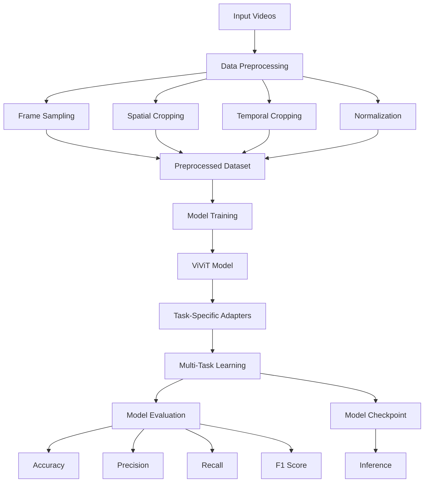
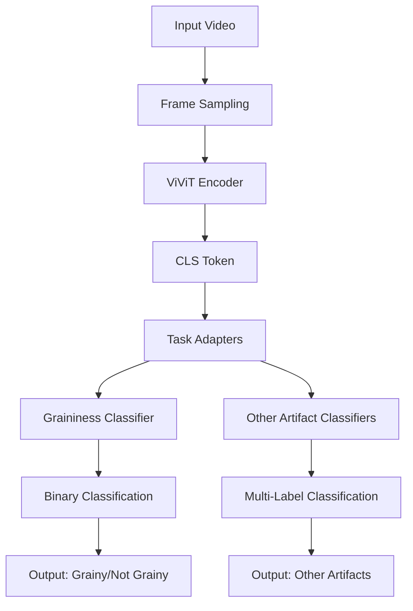
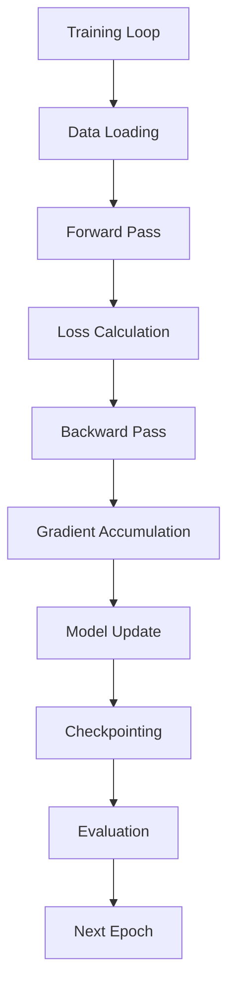
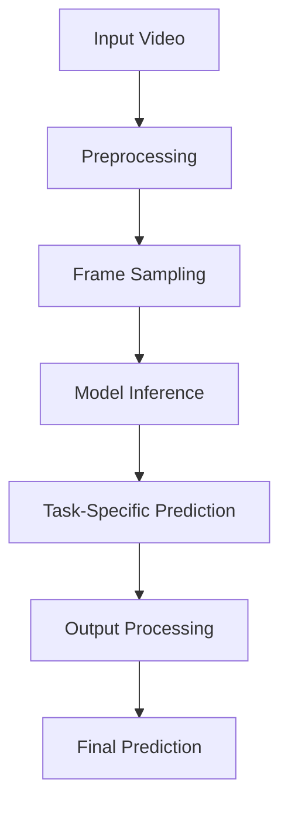

# Project Workflow

## Data Processing and Training Pipeline

```mermaid
graph TD
    A[Input Videos] --> B[Data Preprocessing]
    B --> C[Frame Sampling]
    B --> D[Spatial Cropping]
    B --> E[Temporal Cropping]
    B --> F[Normalization]
    
    C --> G[Preprocessed Dataset]
    D --> G
    E --> G
    F --> G
    
    G --> H[Model Training]
    
    H --> I[ViViT Model]
    I --> J[Task-Specific Adapters]
    J --> K[Multi-Task Learning]
    
    K --> L[Model Evaluation]
    L --> M[Accuracy]
    L --> N[Precision]
    L --> O[Recall]
    L --> P[F1 Score]
    
    K --> Q[Model Checkpoint]
    Q --> R[Inference]
```

## Model Architecture

```mermaid
graph TD
    A[Input Video] --> B[Frame Sampling]
    B --> C[ViViT Encoder]
    
    C --> D[CLS Token]
    D --> E[Task Adapters]
    
    E --> F1[Graininess Classifier]
    E --> F2[Other Artifact Classifiers]
    
    F1 --> G1[Binary Classification]
    F2 --> G2[Multi-Label Classification]
    
    G1 --> H[Output: Grainy/Not Grainy]
    G2 --> I[Output: Other Artifacts]
```

## Training Process

```mermaid
graph TD
    A[Training Loop] --> B[Data Loading]
    B --> C[Forward Pass]
    C --> D[Loss Calculation]
    D --> E[Backward Pass]
    E --> F[Gradient Accumulation]
    F --> G[Model Update]
    G --> H[Checkpointing]
    H --> I[Evaluation]
    I --> J[Next Epoch]
```

## Inference Pipeline

```mermaid
graph TD
    A[Input Video] --> B[Preprocessing]
    B --> C[Frame Sampling]
    C --> D[Model Inference]
    D --> E[Task-Specific Prediction]
    E --> F[Output Processing]
    F --> G[Final Prediction]
``` 